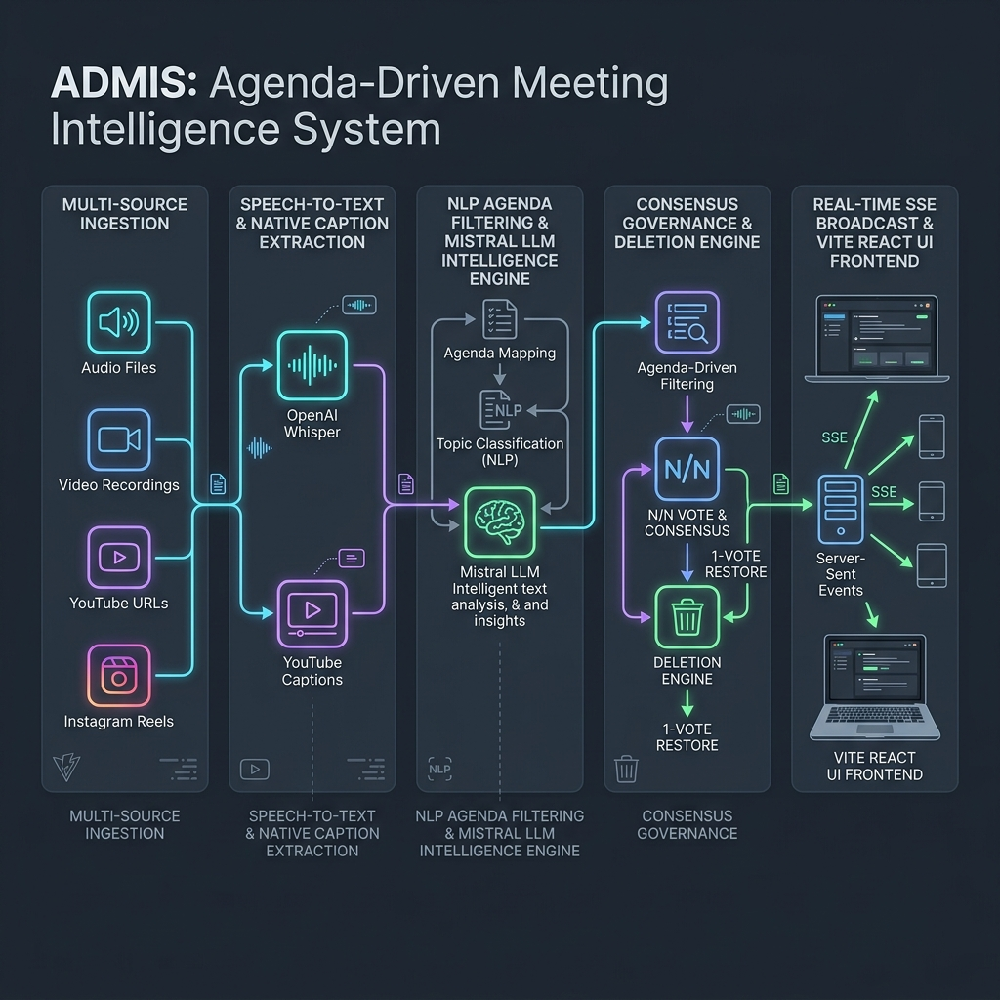
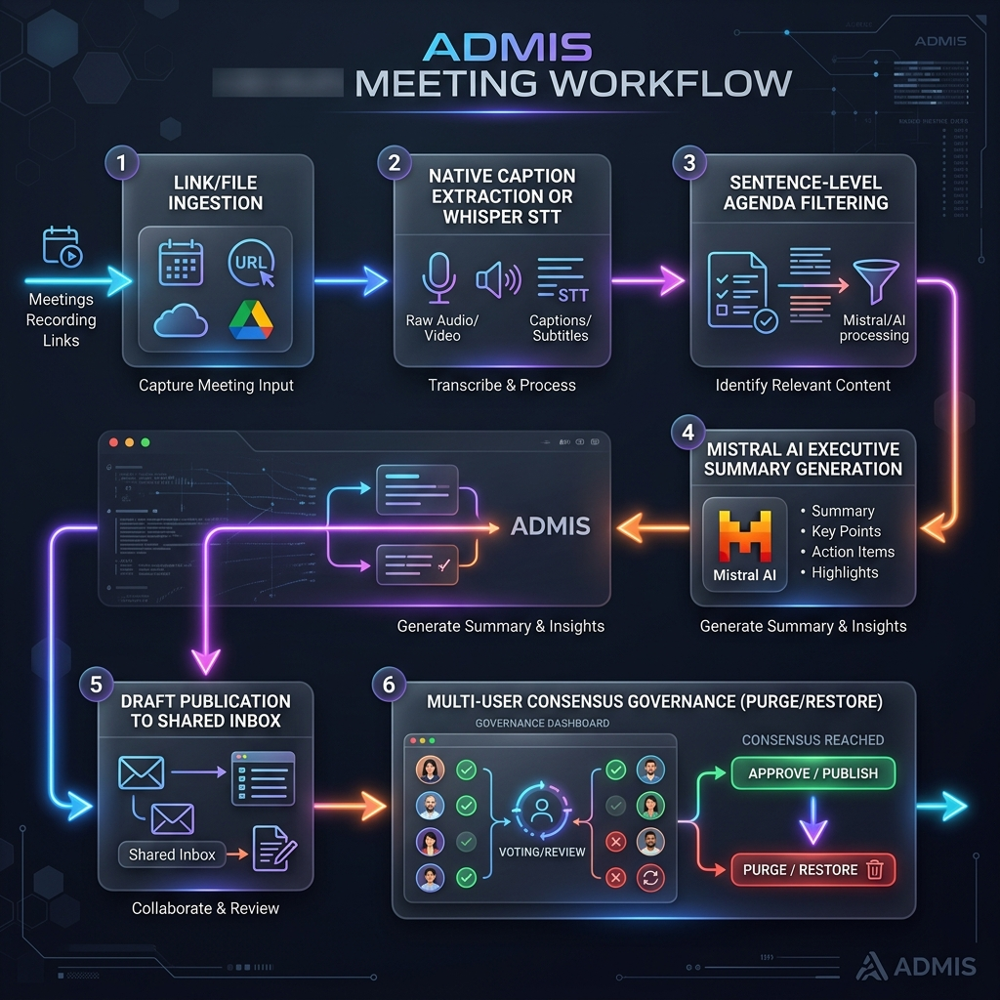

# ADMIS: Agenda-Driven Meeting Intelligence System


**ADMIS (Agenda-Driven Meeting Intelligence System)** is an enterprise-grade, privacy-conscious platform that ingests raw multi-source meeting recordings (audio files, video files, YouTube links, Instagram links, or raw text), extracts transcripts via native caption parsers or **OpenAI Whisper**, filters sentences strictly against defined **agenda topics** using **Mistral AI Large Models**, and enforces **N/N Democratic Consensus Governance** for sensitive document purging and restoration.

---

## 🏗️ Architecture Overview

ADMIS is designed with a decoupled architecture separating media ingestion, STT processing, LLM agenda classification, consensus voting, and real-time frontend streaming.



### Core Architectural Layers
1. **Multi-Source Ingestion Adapter**: Handles file uploads (`.mp3`, `.wav`, `.mp4`, `.mov`, `.txt`) as well as direct link resolution for YouTube (`youtube-transcript-api` / `yt-dlp`) and Instagram.
2. **STT & Native Caption Processing**: Native English caption parser fast path combined with local OpenAI Whisper STT model fallback.
3. **NLP Agenda Filter & LLM Engine**: Sentence-level relevance classifier that filters out greetings, small talk, and off-topic tangents while preserving specific technical metrics, owners, and decisions. Uses `Mistral AI` API with automatic REST fallback.
4. **Consensus Governance Engine**: Democratic deletion lifecycle requiring $N/N$ unanimous `DELETE` votes across all registered users for permanent media purge, or a single $1$-vote `RESTORE` override.
5. **Real-time SSE Broadcast & React UI**: Server-Sent Events (SSE) router pushing real-time document status updates to a modern Vite + React TypeScript single-page app styled with Vanilla CSS glassmorphism & Tailwind.

---

## 🔄 End-to-End System Workflow

The end-to-end data processing workflow transforms raw unstructured meeting audio into structured, agenda-focused executive intelligence:



### Workflow Steps
1. **Submit Meeting**: User submits a media file, raw transcript text, or media link (YouTube/Instagram) along with an explicit **Agenda Topic**.
2. **Link Resolution & STT**: Native captions are extracted immediately or transcribed via Whisper STT into a raw translated English transcript.
3. **Sentence Agenda Classification**: The transcript is segmented into individual sentences and passed to the **Mistral AI Engine** to evaluate relevance against the defined agenda topic.
4. **Executive Summary Generation**: Relevant sentences are synthesized into:
   - **Executive Summary**
   - **Key Decisions**
   - **Action Items** (Task, Owner, Due Date)
   - **Open Questions**
5. **Draft Approval & Feed Publication**: Uploaders inspect draft output and publish it to the shared organization inbox.
6. **Consensus Governance**: Published meetings can be moved to the shared trash bin. Purging requires unanimous consent ($N/N$), while any single user can vote to instantly restore the meeting.

---

## ✨ Key Features

- **Multi-Source Support**: Direct YouTube link ingestion with native caption extraction, Instagram link parsing, and local file uploads.
- **Strict Agenda Filtering**: Filters out off-topic small talk and tangents, keeping only sentences directly relevant to the target agenda.
- **Mistral AI Integration**: Resilient client supporting `mistralai` SDK (v2.x, v1.x, v0.x) with automatic zero-dependency HTTP REST API fallback.
- **Democratic Consensus Governance**: Prevents accidental or single-user deletion of shared meeting intelligence through $N/N$ unanimous purging and $1$-vote instant restore.
- **Real-Time SSE Sync**: Multi-user real-time state synchronization powered by Server-Sent Events.
- **System Health & Diagnostic Logging**: Live LLM connection indicator (`LLM Connected` vs `LLM Not Connected`) and in-app system log viewer powered by rotating file logs (`logs/admis.log`).

---

## 📁 Repository Structure

```text
ADMIS/
├── docs/
│   ├── architecture.png        # Architecture Diagram
│   └── workflow.png            # End-to-End Workflow Diagram
├── backend/
│   ├── main.py                 # FastAPI Web Application & Routes
│   ├── pipeline.py             # STT & NLP Pipeline Orchestrator
│   ├── nlp_filter.py           # Sentence Agenda Classifier
│   ├── summarizer.py           # Executive Summary Generator
│   ├── source_adapter.py       # YouTube & Media Link Ingestion
│   ├── llm_client.py           # Resilient Mistral LLM Wrapper
│   ├── logger.py               # Rotating File Logger (logs/admis.log)
│   ├── models.py               # SQLAlchemy Database Schemas
│   ├── db.py                   # SQLite Connection & Session Setup
│   ├── seed.py                 # Seed Demo User Accounts
│   ├── auth.py                 # User Context & Header Auth
│   ├── broadcast.py            # Real-time SSE Broadcast Router
│   ├── test_backend.py         # End-to-End Backend Verification Suite
│   └── requirements.txt        # Python Dependencies
├── frontend/
│   ├── src/
│   │   ├── App.tsx             # Main React Application
│   │   ├── api.ts              # Backend API Client
│   │   ├── types.ts            # TypeScript Interfaces
│   │   ├── index.css           # Glassmorphism & Custom CSS
│   │   └── components/
│   │       ├── DocumentCard.tsx
│   │       ├── DocumentDetailModal.tsx
│   │       ├── LogViewerModal.tsx
│   │       ├── StatusBadge.tsx
│   │       ├── UploadModal.tsx
│   │       └── UserSwitcher.tsx
│   ├── package.json            # Node Dependencies & Scripts
│   ├── tailwind.config.js      # Tailwind Configuration
│   └── vite.config.ts          # Vite Configuration
├── .gitignore                  # Git Exclusion Rules
├── LICENSE                     # MIT License
├── run.py                      # One-Click Full-Stack Launcher
└── README.md                   # System Documentation
```

---

## 🚀 Quick Start Guide

### Prerequisites
- **Python 3.10+**
- **Node.js 18+** & **npm**
- **Mistral AI API Key** ([Get your key here](https://console.mistral.ai/api-keys))

### 1. Environment Setup
Copy the sample environment file in `backend/` and insert your API key:
```bash
cp backend/.env
```
In `backend/.env`:
```ini
MISTRAL_API_KEY=your_mistral_api_key_here
WHISPER_MODEL=base
DATABASE_URL=sqlite:///./admis.db
```

### 2. Backend Setup
```bash
cd backend
pip install -r requirements.txt
python test_backend.py
```

### 3. Frontend Setup
```bash
cd frontend
npm install
npm run build
```

### 4. Running the Full Application
Start both the FastAPI backend and Vite frontend dev server using the launcher script:
```bash
python run.py
```
- **Frontend App**: `http://localhost:5173`
- **FastAPI API Docs**: `http://localhost:8000/docs`

---

## 📑 API Endpoints

| Method | Endpoint | Description |
| :--- | :--- | :--- |
| `GET` | `/system/status` | Check system health and LLM connection status |
| `GET` | `/system/logs` | Fetch recent system log output from `logs/admis.log` |
| `GET` | `/users` | List registered demo user accounts |
| `POST` | `/documents/upload` | Upload audio/video/text file with agenda topic |
| `POST` | `/documents/ingest-url` | Ingest YouTube or Instagram URL with agenda topic |
| `GET` | `/documents/feed` | Shared feed of published meeting intelligence |
| `GET` | `/documents/drafts` | Uploader draft documents awaiting approval |
| `POST` | `/documents/{id}/publish` | Publish draft document to shared inbox |
| `POST` | `/documents/{id}/delete` | Move published document to democratic trash bin |
| `POST` | `/documents/{id}/vote` | Cast consensus vote (`DELETE` or `RESTORE`) |
| `GET` | `/events` | Real-time Server-Sent Events (SSE) stream |

---

## 📜 License

Distributed under the **MIT License**. See [LICENSE](LICENSE) for details.
