<div align="center">

# ⚡ ADMIS
### **Agenda-Driven Meeting Intelligence System**

*Transform chaotic, tangent-heavy meeting recordings into crisp, agenda-focused executive intelligence.*

[](LICENSE)
[](https://python.org)
[](https://fastapi.tiangolo.com)
[](https://reactjs.org)
[](https://www.typescriptlang.org/)
[](https://mistral.ai)
[](https://github.com/openai/whisper)
[](https://tailwindcss.com)

[Explore Architecture](#-system-architecture) • [Key Features](#-key-features) • [Quick Start](#-quick-start-guide) • [API Documentation](#-api-endpoints) • [Governance Model](#-democratic-consensus-governance)

</div>

---

## 🎯 Executive Overview

Modern enterprise meetings are notoriously inefficient—teams spend 60 minutes in a meeting to capture 10 minutes of actual core business goals. Existing meeting transcription tools capture **everything**—small talk, coffee breaks, tangent arguments, and greetings.

**ADMIS (Agenda-Driven Meeting Intelligence System)** solves this exact problem. By coupling **Speech-to-Text (OpenAI Whisper)** with **Mistral AI NLP Sentence Classification**, ADMIS filters transcripts strictly against target **Agenda Topics**, stripping out off-topic noise and delivering structured executive action plans.

> [!IMPORTANT]
> **Why ADMIS is Different**: Unlike standard transcript summarizers that process the entire transcript (including tangents), ADMIS performs sentence-by-sentence agenda evaluation, keeping only text explicitly tied to target meeting objectives.

---

## ✨ Key Features

| Feature | Description | Benefit |
| :--- | :--- | :--- |
| 🎯 **Agenda NLP Classifier** | Evaluates individual transcript sentences against target agenda topics via Mistral AI. | Eliminates greetings & off-topic ramblings. |
| 📥 **Universal Source Ingestion** | Ingests `.mp3`, `.wav`, `.mp4`, `.mov`, `.txt`, **YouTube URLs** & **Instagram links**. | No manual file conversion needed. |
| 🎙️ **Hybrid STT Engine** | Fast-path YouTube/Instagram caption extraction with OpenAI Whisper STT fallback. | Blazing fast transcript generation. |
| 🗳️ **Democratic Consensus Purge** | Requires $N/N$ unanimous consensus votes across all users to permanently delete data. | Zero accidental data loss in shared spaces. |
| ⚡ **Instant 1-Vote Restore** | Any single user can instantly vote to restore a trashed document. | Safeguards critical organizational assets. |
| 📡 **Real-Time SSE Sync** | Server-Sent Events push document status & voting updates across connected browsers live. | Instant team alignment without browser refreshes. |
| 🟢 **Live LLM & Log Monitoring** | Real-time connection badge (`LLM Connected`) & built-in interactive log viewer modal. | Transparent runtime diagnostics. |

---

## 🏗️ System Architecture

ADMIS is architected with a decoupled microservice paradigm separating input adapters, STT transcription, NLP classification, consensus state machines, and real-time streaming interfaces.


### Core Architectural Layers
1. **Multi-Source Ingestion Adapter**: High-throughput file uploads & link parsers (`youtube-transcript-api` / `yt-dlp`).
2. **STT & Caption Processor**: Parallel English caption parser paired with local OpenAI Whisper model fallback (`base`/`small`/`medium`).
3. **NLP Agenda Classifier & LLM Engine**: Multi-tier Mistral AI integration (`mistralai` SDK v2/v1 with auto zero-dependency REST HTTP fallback).
4. **Consensus Governance Engine**: Unanimous ($N/N$) state transitions for media purging with single-vote override restoration.
5. **Real-time Broadcast & Glassmorphism UI**: FastAPI SSE streaming server driving a Vite + React + TypeScript single-page app.

---

## 🔄 End-to-End Workflow

The complete transformation lifecycle from multi-source raw media into clean executive intelligence:

```mermaid
flowchart LR
    A[Raw Media / Link] --> B[Source Adapter]
    B --> C[OpenAI Whisper STT]
    C --> D[Raw Sentences]
    D --> E[Mistral AI Agenda Classifier]
    E -->|Filtered Sentences| F[Executive Summary Engine]
    F --> G[Uploader Draft]
    G -->|Publish| H[Shared Inbox Feed]
    H -->|Trash| I[Democratic Voting]
    I -->|N/N Unanimous| J[Permanent Purge]
    I -->|1-Vote Restore| H
```




---

## 📁 Repository Structure

```text
ADMIS/
├── 📁 docs/                     # Architectural & Workflow Diagrams
│   ├── 🖼️ architecture.png     # Architecture Visual Diagram
│   └── 🖼️ workflow.png         # System Processing Workflow
├── 📁 backend/                  # FastAPI Core Backend Service
│   ├── 🚀 main.py              # Application Entry & REST API Routes
│   ├── ⚙️ pipeline.py          # Asynchronous STT & NLP Orchestrator
│   ├── 🧠 nlp_filter.py        # Sentence Agenda Relevance Classifier
│   ├── 📝 summarizer.py        # Executive Summary & Action Items Generator
│   ├── 🔌 source_adapter.py    # YouTube & Instagram Ingestion Adapters
│   ├── 🤖 llm_client.py        # Mistral AI SDK & REST Fallback Wrapper
│   ├── 📜 logger.py            # System Logging Engine (logs/admis.log)
│   ├── 🗄️ models.py            # SQLAlchemy Database Data Models
│   ├── 💾 db.py                # Database Engine & Session Factory
│   ├── 🌱 seed.py              # Automatic Demo User Initializer
│   ├── 🔐 auth.py              # User Context & Header Authentication
│   ├── 📡 broadcast.py         # Real-time Server-Sent Events Router
│   ├── 🧪 test_backend.py      # End-to-End API Verification Suite
│   └── 📄 requirements.txt     # Python Dependencies Specification
├── 📁 frontend/                 # React + TypeScript + Vite Single-Page App
│   ├── 📁 src/
│   │   ├── ⚛️ App.tsx          # Master React Application Layout & State
│   │   ├── 🔌 api.ts           # Axios Backend API Integration Client
│   │   ├── 🏷️ types.ts         # TypeScript Domain Data Interfaces
│   │   ├── 🎨 index.css        # Glassmorphism Styling & Design System
│   │   └── 🧩 components/     # High-Performance UI Components
│   │       ├── DocumentCard.tsx
│   │       ├── DocumentDetailModal.tsx
│   │       ├── LogViewerModal.tsx
│   │       ├── StatusBadge.tsx
│   │       ├── UploadModal.tsx
│   │       └── UserSwitcher.tsx
│   ├── 📄 package.json         # Node Dependencies & Build Scripts
│   ├── ⚙️ tailwind.config.js   # Custom Tailwind Configuration
│   └── ⚡ vite.config.ts       # Vite Development & Build Server Settings
├── 📄 .gitignore               # Git Version Control Exclusion Rules
├── 📄 LICENSE                  # Official MIT License File
├── 🐍 run.py                   # One-Click Full-Stack Launcher
└── 📘 README.md                # Interactive System Documentation
```

---

## ⚡ Quick Start Guide

Follow these steps to launch ADMIS locally in under 60 seconds:

### 1️⃣ Prerequisites
- **Python 3.10+** installed
- **Node.js 18+** & **npm** installed
- **Mistral AI API Key** ([Get your free key](https://console.mistral.ai/api-keys))

### 2️⃣ Environment Setup
Create a `.env` file inside the `backend/` directory:
```bash
cp backend/.env.example backend/.env   # Or create backend/.env directly
```
Add your configurations:
```ini
MISTRAL_API_KEY=your_actual_mistral_api_key
WHISPER_MODEL=base
DATABASE_URL=sqlite:///./admis.db
```

### 3️⃣ Installation

```bash
# Setup Python Backend
cd backend
pip install -r requirements.txt

# Setup React Frontend
cd ../frontend
npm install
```

### 4️⃣ One-Click Launch 🚀

Return to the root directory and run the launcher script:
```bash
python run.py
```

Now open your browser:
* 🌐 **Frontend Application**: [`http://localhost:5173`](http://localhost:5173)
* 📑 **Interactive API Docs (Swagger UI)**: [`http://localhost:8000/docs`](http://localhost:8000/docs)

---

## 🗳️ Democratic Consensus Governance

To prevent single-user accidental deletions or malicious removal of critical meeting records, ADMIS implements a strict **N/N Democratic Governance Model**:

```
                       [ PUBLISHED DOCUMENT ]
                                 │
                                 ▼ (Moved to Trash)
                         [ TRASHED DOCUMENT ]
                                 │
                 ┌───────────────┴───────────────┐
                 ▼                               ▼
       [ Cast DELETE Vote ]             [ Cast RESTORE Vote ]
                 │                               │
        Votes == Total Users?                    │
         ├── YES ──► 💀 PERMANENT PURGE          └──► ♻️ INSTANT RESTORE TO FEED
         └── NO  ──► ⏳ Waiting Consensus
```

* **Unanimous Delete ($N/N$)**: Permanent deletion occurs **only** when 100% of registered organization users vote to `DELETE`.
* **Instant Restore Override ($1$-Vote)**: A single `RESTORE` vote immediately cancels the pending purge and restores the document back to the active feed.

---

## 📑 API Endpoints

<details>
<summary><b>Click to expand full API specification</b></summary>

| Category | Method | Endpoint | Description | Auth Header |
| :--- | :---: | :--- | :--- | :---: |
| **System** | `GET` | `/system/status` | System health check & LLM connection state | *None* |
| **System** | `GET` | `/system/logs` | Fetch real-time system logs (`logs/admis.log`) | *None* |
| **Users** | `GET` | `/users` | List all registered demo users | *None* |
| **Documents** | `POST` | `/documents/upload` | Upload audio/video/text file with agenda topic | `X-User-Id` |
| **Documents** | `POST` | `/documents/ingest-url` | Ingest YouTube or Instagram media link | `X-User-Id` |
| **Documents** | `GET` | `/documents/feed` | List published meeting intelligence feed | `X-User-Id` |
| **Documents** | `GET` | `/documents/drafts` | List uploader draft documents | `X-User-Id` |
| **Documents** | `GET` | `/documents/{id}` | Get full detailed document analysis | `X-User-Id` |
| **Documents** | `POST` | `/documents/{id}/publish` | Publish draft document to shared feed | `X-User-Id` |
| **Governance** | `POST` | `/documents/{id}/delete` | Move published document to trash bin | `X-User-Id` |
| **Governance** | `POST` | `/documents/{id}/vote` | Cast consensus vote (`DELETE` or `RESTORE`) | `X-User-Id` |
| **Realtime** | `GET` | `/events` | Server-Sent Events (SSE) live push stream | *None* |

</details>

---

## 🧪 Verification & Testing

To run the automated backend unit & integration verification test suite:

```bash
cd backend
python test_backend.py
```

This suite validates database initialization, link processing, OpenAI Whisper STT fallback, Mistral LLM API calls, and the full consensus voting state transitions.

---

## 💻 Tech Stack

```text
Backend:      Python 3.10+ | FastAPI | SQLAlchemy | SQLite | PyYAML
AI & NLP:     Mistral AI (Large Models) | OpenAI Whisper STT | youtube-transcript-api | yt-dlp
Frontend:     React 18 | TypeScript | Vite | Tailwind CSS v3.4 | Lucide Icons | Axios
Realtime:     Server-Sent Events (SSE) Streaming
Governance:   N/N Unanimous Voting State Machine
```

---

## 📜 License

This project is licensed under the **MIT License**. See the [LICENSE](LICENSE) file for details.

<div align="center">

**Made with ❤️ for agenda-driven enterprise productivity.**

⭐ **If you find ADMIS helpful, give it a star on GitHub!** ⭐

</div>

